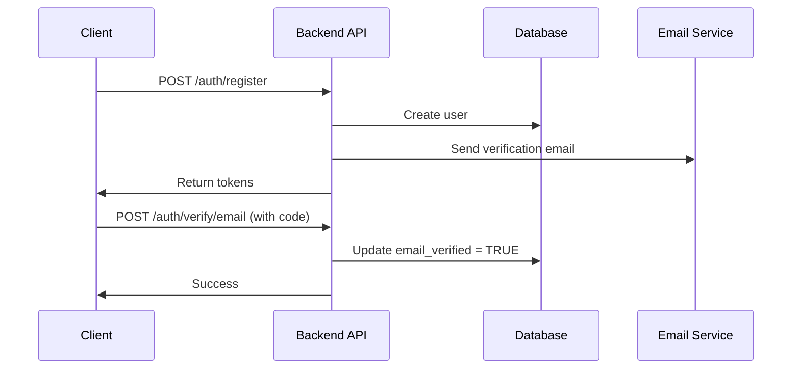
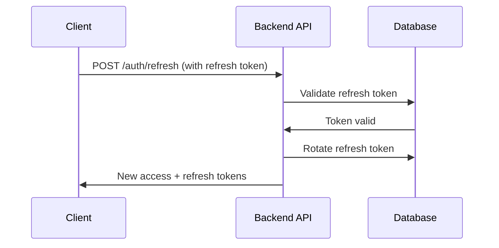

# iWent Backend PRD (Product Requirements Document)

> **Version:** 3.0
> **Date:** January 2026
> **Status:** Approved
> **Platform:** Node.js Modular Monolith on Supabase

---

## Document Information

| Property | Value |
|----------|-------|
| **Project Name** | iWent Backend |
| **Document Type** | Product Requirements Document |
| **Version** | 3.0 (Updated from v2.0) |
| **Last Updated** | January 26, 2026 |
| **Prepared By** | Product Management & Backend Team |
| **Target Audience** | Backend Developers, Claude Code AI, Technical Stakeholders |
| **Approval Status** | ✅ Approved |

---

## Change Log

| Version | Date | Author | Changes |
|---------|------|--------|---------|
| 1.0 | 2025-12 | Product Team | Initial draft |
| 2.0 | 2026-01-15 | Backend Team | Roadmap alignment, OpenAPI specs |
| **3.0** | **2026-01-26** | **Product Team** | **Frontend gap analysis, 10 new features added** |

---

## Table of Contents

1. [Executive Summary](#1-executive-summary)
2. [Kullanıcı Tipleri ve Yetkilendirme](#2-kullanıcı-tipleri-ve-yetkilendirme)
3. [Fonksiyonel Gereksinimler](#3-fonksiyonel-gereksinimler)
   - 3.1. [Organizatör Paneli Backend Gereksinimleri](#31-organizatör-paneli-backend-gereksinimleri)
   - 3.2. [User (Welcome Screen) Backend Gereksinimleri](#32-user-welcome-screen-backend-gereksinimleri)
4. [API Gereksinimleri](#4-api-gereksinimleri)
5. [Veritabanı Gereksinimleri](#5-veritabanı-gereksinimleri)
6. [Teknik Olmayan Gereksinimler](#6-teknik-olmayan-gereksinimler)
7. [Fazlar (Implementation Phases)](#7-fazlar-implementation-phases)
8. [Riskler ve Varsayımlar](#8-riskler-ve-varsayımlar)
9. [Appendix](#9-appendix)

---

## 1. Executive Summary

### 1.1 Platform Vizyonu

**iWent**, etkinlik katılımını sosyal etkileşime dönüştüren ileri seviye bir mobil etkinlik biletleme platformudur. Platform, etkinlik öncesi ve sonrasında katılımcılar arasında anlamlı bağlantılar kurarak, etkinlik deneyimini yalnızca bir katılım sürecinden öte, güçlü sosyal bağların oluşabileceği bir ekosisteme dönüştürür.

#### Ana Değer Önerisi
- **Sosyal Etkileşim**: Etkinlik özelinde sohbet grupları ve topluluk oluşturma
- **Anlamlı Bağlantılar**: Arkadaşlık ve sosyal ağ kurma
- **Dijital Denge**: "Ekrana bakma, iwent dahi olsa" felsefesi ile sağlıklı dijital yaşam
- **Tıklanabilirlik**: Her bilgi tıklanabilir - keşif ve bilgiye demokratik erişim

### 1.2 Teknik Stack Kararları (SABİT - Değiştirilemez)

| Teknoloji | Seçim | Sebep |
|-----------|-------|-------|
| **Authentication** | JWT (Access + Refresh) | Fine-grained control, stateless |
| **Real-time** | Supabase Realtime | WebSocket + PostgreSQL Change Data Capture |
| **File Storage** | Supabase Storage | S3-compatible, integrated with auth |
| **Deployment** | Supabase | Managed PostgreSQL + edge functions |
| **Backend Framework** | Fastify + TypeScript | High performance, type-safe |
| **ORM** | Prisma | Type-safe queries, migration management |
| **Architecture** | Modular Monolith | Simple to start, can split later |

### 1.3 MVP Scope Tanımı

#### ✅ MVP Kapsamında
1. **iwent-welcome-screen** (Son Kullanıcılar)
   - Etkinlik arama ve keşif
   - Bilet satın alma
   - Arkadaşlık ve sosyal özellikler
   - Chat (personal + event)
   - **[YENİ]** User stories (24-hour posts)
   - Profil yönetimi

2. **iwent-organizator-paneli** (Organizatörler)
   - Etkinlik yönetimi (CRUD, draft→publish flow)
   - Bilet yönetimi (ticket types, pricing)
   - Katılımcı yönetimi ve check-in
   - Analitik dashboard
   - Chat moderasyonu
   - Finansal raporlama

#### ❌ MVP Kapsamı Dışı
- **iwent-admin-panel** (Platform Yöneticileri)
  - Admin panel özellikleri post-MVP'de geliştirilecek
  - Şu aşamada admin endpoint'leri oluşturulmayacak

### 1.4 Başarı Metrikleri

#### Teknik Metrikler
| Metrik | Hedef (MVP) | Hedef (Production) |
|--------|-------------|---------------------|
| API Response Time (P95) | <500ms | <300ms |
| Database Query Time (P95) | <100ms | <50ms |
| Uptime | >99% | >99.9% |
| Concurrent Users | 10,000 | 100,000 |
| Zero Double-Booking | 100% | 100% |
| Story Auto-Deletion Success | 100% | 100% |

#### Business Metrikler
| Metrik | 3 Ay | 6 Ay | 12 Ay |
|--------|------|------|-------|
| Aktif Organizatörler | 50 | 200 | 1,000 |
| Aktif Kullanıcılar | 5,000 | 20,000 | 100,000 |
| Aylık Etkinlik Sayısı | 100 | 500 | 2,000 |
| Story Feature Adoption | >60% | >75% | >80% |
| NLP Search Usage | >30% | >50% | >60% |

### 1.5 v3.0 Güncelleme Özeti

**10 Major Gap Tespit Edildi** (Frontend'de var, backend'de eksik):

#### Yeni Özellikler
1. ✅ **User Stories** - 24 saatlik fotoğraf/video paylaşımı (3 tablo + 4 endpoint)
2. ✅ **Ticket Gifting** - Arkadaşlara bilet hediye etme (4 kolon + 1 endpoint)
3. ✅ **"Karşılık Bekle" Media** - Chat'te özel medya modu (2 kolon + business logic)
4. ✅ **Hitap Şekli** - Sen/siz tercihi (preference güncellemesi)
5. ✅ **Natural Language Search** - Doğal dil ile arama (1 endpoint + LLM)

#### Eksik Endpoint'ler
6. ✅ **Venue Reviews** - CRUD endpoint'leri (4 endpoint)
7. ✅ **Event Attachments** - GET endpoint (1 endpoint)
8. ✅ **Discount Codes** - DELETE, GET by ID (2 endpoint)
9. ✅ **Pricing Rules** - GET endpoint (1 endpoint)

#### Gap Fix
10. ✅ **Profil Görünürlük** - "Sadece ortak etkinliğe katılanlar görür" kuralı

**Toplam Eklenen**:
- 3 yeni tablo
- 8 kolon güncelleme
- 17 yeni endpoint
- 2 yeni schema
- 1 cron job (story cleanup)
- 1 storage bucket (stories)

---

## 2. Kullanıcı Tipleri ve Yetkilendirme

### 2.1 Role Hierarchy

iWent platformu 4 farklı kullanıcı rolü destekler:

| Role | Açıklama | MVP Kapsamı |
|------|----------|-------------|
| **public** | Kayıt olmamış ziyaretçiler | ✅ Evet |
| **user** | Son kullanıcılar (katılımcılar) | ✅ Evet |
| **organizer** | Etkinlik düzenleyenler | ✅ Evet |
| **admin** | Platform yöneticileri | ❌ Post-MVP |

#### Role İlişkileri
- Bir `user` "Organizatör Ol" butonu ile `organizer` olabilir
- `organizer` rolleri `user` rolünün tüm yetkilerine sahiptir (role inheritance)
- `admin` rolleri tüm yetkile sahiptir (post-MVP)

### 2.2 Permission Matrix

#### Event Resource Permissions

| Kaynak | Public | User | Organizer | Admin |
|--------|--------|------|-----------|-------|
| **Events** (list, search) | ✓ | ✓ | ✓ | ✓ |
| **Events** (detail) | ✓ | ✓ | ✓ | ✓ |
| **Events** (create) | ✗ | ✗ | ✓ | ✓ |
| **Events** (update) | ✗ | ✗ | ✓ (own) | ✓ (all) |
| **Events** (delete) | ✗ | ✗ | ✓ (own) | ✓ (all) |
| **Events** (publish) | ✗ | ✗ | ✓ (own) | ✓ (all) |

#### Order & Ticket Permissions

| Kaynak | Public | User | Organizer | Admin |
|--------|--------|------|-----------|-------|
| **Orders** (create) | ✗ | ✓ | ✓ | ✓ |
| **Orders** (read) | ✗ | ✓ (own) | ✓ (own events) | ✓ (all) |
| **Tickets** (view) | ✗ | ✓ (own) | ✓ (own events) | ✓ (all) |
| **Tickets** (gift) | ✗ | ✓ (own) | ✓ | ✓ |
| **Tickets** (refund) | ✗ | ✓ (request) | ✓ (approve) | ✓ (all) |

#### Social Features Permissions

| Kaynak | Public | User | Organizer | Admin |
|--------|--------|------|-----------|-------|
| **Friends** (list) | ✗ | ✓ (own) | ✓ (own) | ✓ (all) |
| **Friends** (request) | ✗ | ✓ | ✓ | ✓ |
| **Chat** (personal) | ✗ | ✓ (friends only) | ✓ (friends only) | ✓ |
| **Chat** (event) | ✗ | ✓ (ticket holders) | ✓ (own events) | ✓ |
| **Chat** (moderate) | ✗ | ✗ | ✓ (own events) | ✓ |
| **Stories** (create) | ✗ | ✓ | ✓ | ✓ |
| **Stories** (view) | ✗ | ✓ (friends only) | ✓ (friends only) | ✓ |

#### Analytics & Moderation Permissions

| Kaynak | Public | User | Organizer | Admin |
|--------|--------|------|-----------|-------|
| **Analytics** | ✗ | ✗ | ✓ (own events) | ✓ (all) |
| **Moderation** (reports) | ✗ | ✓ (create) | ✓ (manage own events) | ✓ (all) |
| **Moderation** (filters) | ✗ | ✗ | ✓ (own events) | ✓ (all) |

### 2.3 JWT Claims Structure

#### Access Token (15 min TTL)
```json
{
  "sub": "uuid",
  "email": "user@example.com",
  "role": "user|organizer|admin",
  "organizerId": "uuid",
  "iat": 1706284800,
  "exp": 1706285700
}
```

#### Refresh Token (7 days TTL)
```json
{
  "sub": "uuid",
  "tokenId": "uuid",
  "iat": 1706284800,
  "exp": 1706889600
}
```

### 2.4 Authentication Flow

#### Registration & Login


#### Token Refresh Flow


### 2.5 Authorization Middleware

#### Endpoint Protection Example
```typescript
// Require authentication
fastify.get('/users/me', {
  preHandler: [requireAuth],
  handler: getUserProfile
});

// Require specific role
fastify.post('/org/events', {
  preHandler: [requireAuth, requireRole('organizer')],
  handler: createEvent
});

// Require resource ownership
fastify.put('/org/events/:id', {
  preHandler: [requireAuth, requireRole('organizer'), requireOwnership('event')],
  handler: updateEvent
});
```

#### Row Level Security (RLS) Integration

Supabase'in RLS politikaları backend'den bağımsız çalışır:

```sql
-- Users can only see their own orders
CREATE POLICY orders_select_own ON orders
  FOR SELECT USING (auth.uid() = user_id);

-- Organizers can see their own event orders
CREATE POLICY orders_select_organizer ON orders
  FOR SELECT USING (
    EXISTS (
      SELECT 1 FROM events e
      JOIN organizers o ON e.organizer_id = o.id
      WHERE e.id = orders.event_id
      AND o.user_id = auth.uid()
    )
  );
```

### 2.6 Special Permission Rules

#### Profil Görünürlük Kuralı ⚠️
**Kural**: Kullanıcılar sadece ortak etkinliğe katıldıkları kullanıcıların profillerini görebilir.

```sql
-- User A can view User B's full profile IF:
SELECT EXISTS (
  SELECT 1
  FROM tickets t1
  JOIN tickets t2 ON t1.event_id = t2.event_id
  WHERE t1.user_id = :user_a_id
  AND t2.user_id = :user_b_id
  AND t1.status = 'CONFIRMED'
  AND t2.status = 'CONFIRMED'
) AS can_view_profile;

-- OR they are friends:
SELECT EXISTS (
  SELECT 1 FROM friendships
  WHERE (requester_id = :user_a_id AND addressee_id = :user_b_id)
     OR (requester_id = :user_b_id AND addressee_id = :user_a_id)
  AND status = 'accepted'
) AS are_friends;
```

**İmplementasyon**:
- `GET /users/{userId}` endpoint'i bu kontrolü yapar
- Ortak etkinlik veya arkadaşlık yoksa, sadece `name` ve `avatarUrl` dönülür
- Arkadaşlık isteği gönderilebilir ama profil detayları görülemez

---


## 3. Fonksiyonel Gereksinimler

> **Not**: Bu bölümdeki tüm detaylı gereksinimler, validation kuralları ve business logic için [Plan Dosyasına](../../.claude/plans/elegant-sauteeing-bentley.md) bakınız.

### 3.1 Organizatör Paneli Backend Gereksinimleri

- **Etkinlik Yönetimi**: Draft→Published workflow, CRUD, duplicate, validation
- **Bilet Yönetimi**: Ticket type CRUD, dynamic pricing, discount codes, inventory control
- **Katılımcı Yönetimi**: Attendee list, QR check-in, bulk check-in
- **Analitik**: Dashboard, time-series, conversion funnel, demographics
- **Moderasyon**: Chat management, word filters, reports
- **Takım**: Team member invite, permissions

### 3.2 User (Welcome Screen) Backend Gereksinimleri

- **Keşif**: Event listing, full-text search, **[YENİ]** NLP search, discovery feed, map view
- **Arkadaşlık**: Friend requests, list, block/unblock, **[GAP]** profile visibility rules
- **[YENİ] Stories**: Create, view, tag friends, 24h auto-delete, viewer list (friends only), video support
- **Bilet**: Purchase, payment, view tickets, **[YENİ]** gift tickets (1x only)
- **Chat**: Personal, event chats, real-time WebSocket, **[YENİ]** reciprocal media unlock
- **Ayarlar**: Notifications, **[YENİ]** addressing style (sen/siz)
- **Venue/Artist**: Details, **[EKSIK]** venue reviews, artist follow

---

## 4. API Gereksinimleri

**Toplam Endpoint**: 144 (130 mevcut + 14 yeni)

### Yeni Endpoint'ler (14 adet)

| Kategori | Endpoint | Method |
|----------|----------|--------|
| **Stories** | /users/me/stories | POST, GET, DELETE |
| **Stories** | /users/{userId}/stories | GET |
| **Stories** | /stories/{id}/view | POST |
| **Gifting** | /tickets/{id}/gift | POST |
| **Venue Reviews** | /venues/{id}/reviews | POST, GET |
| **Venue Reviews** | /venues/reviews/{id} | PATCH, DELETE |
| **Attachments** | /events/{id}/attachments | GET |
| **Discounts** | /org/events/{eventId}/discount-codes/{codeId} | GET, DELETE |
| **Pricing** | /org/events/{id}/pricing-rules | GET |
| **NLP Search** | /search/natural | POST |

### Real-time Subscriptions
- Chat messages (Supabase Realtime)
- Notifications (Supabase Realtime)
- Ticket sales (Organizer dashboard)

> **Detaylı API Specs**: `iwent_openapi_v2.yaml` dosyasına bakınız.

---

## 5. Veritabanı Gereksinimleri

### Yeni Tablolar (3 adet)
- `user_stories` - 24h story posts
- `story_tags` - Story'de etiketlenen kullanıcılar
- `story_views` - Story görüntüleme kayıtları

### Güncellemeler
- `tickets`: +4 kolon (gifted_by, gifted_to, gifted_at, gift_message)
- `messages`: +2 kolon (requires_reciprocation, reciprocation_media_url)
- `users.preferences`: addressingStyle field (JSONB)

### Index'ler (+5)
- Stories expiry, full-text search, profil görünürlük, chat performance

### Storage
- Supabase Stories bucket + RLS policies

### Cron Job
- Hourly story cleanup (Edge Function)

> **Detaylı Schema**: `iwent_database_schema_v2.sql` dosyasına bakınız.

---

## 6. Teknik Olmayan Gereksinimler

- **Performans**: P95 <500ms (most endpoints), <1.5s (NLP search)
- **Güvenlik**: JWT, Argon2id, RLS, rate limiting
- **Reliability**: 99% uptime (MVP), daily backups
- **Scalability**: Stateless servers, connection pooling, 3-layer caching

---

## 7. Fazlar (Implementation Phases)

### MVP (Faz 1-5): 18 hafta
- Faz 1: Foundation (2w)
- Faz 2: Core Events + **Venue Reviews** (3w)
- Faz 3: Organizer Tools (3w)
- Faz 4: Ticketing + **Gifting** (4w)
- Faz 5: Social + **Stories (video)** + **Reciprocal Media** + **Profile Visibility** (6w)

### Post-MVP (Faz 6-8): 7 hafta
- Faz 6: Analytics (2w)
- Faz 7: Moderation (2w)
- Faz 8: AI + **NLP Search** (3w)

**Toplam**: 25 hafta (~6.5 ay)

---

## 8. Riskler ve Varsayımlar

### Teknik Riskler
- Supabase free tier limit → Erken upgrade
- Story storage costs → 24h auto-delete
- NLP search accuracy → Fallback to keyword
- Race condition → FOR UPDATE lock

### Business Riskler
- Scope creep → Sıkı prioritization
- Low adoption → Beta testing

### Varsayımlar
- Supabase Pro yeterli (6 ay)
- 50 organizatör (3 ay), 5,000 user (6 ay)
- Story adoption >60%, NLP search >30%

---

## 9. Appendix

### Referans Dokümanlar
- [Plan Dosyası (Detaylı)](../../.claude/plans/elegant-sauteeing-bentley.md)
- [Database Schema](./iwent_database_schema_v2.sql)
- [API Spec](./iwent_openapi_v2.yaml)
- [Roadmap](./iWent_Technical_Roadmap.md)
- [Ürün Vizyonu](./iwent-summary.txt)

### Kullanıcı Kararları ✅
1. Story viewers: Arkadaşlar listesi gösterilecek
2. Venue review moderation: Sadece admin
3. Gift chain: Hayır, 1x only
4. Video desteği: Evet, MVP'de

---

**Document End** - v3.0 | January 26, 2026

*Detaylı içerik için plan dosyasına bakınız.*
